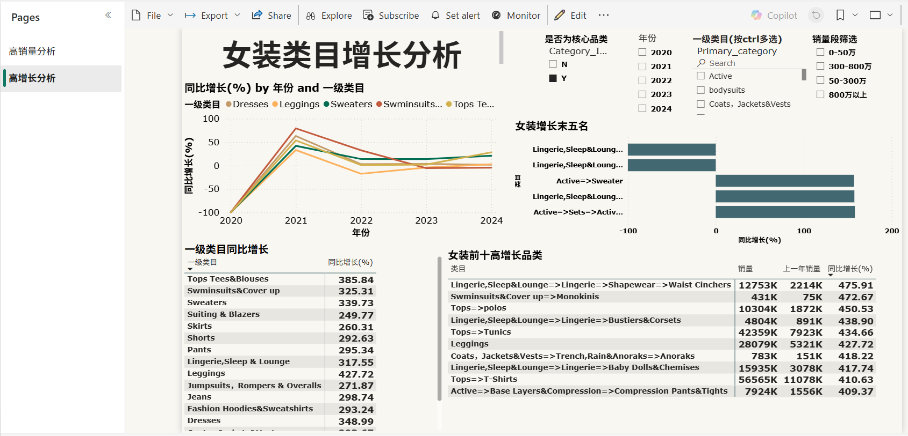
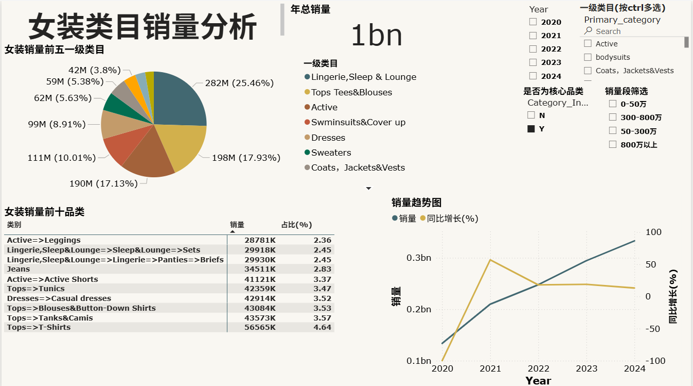
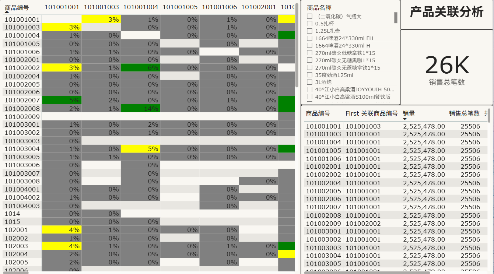
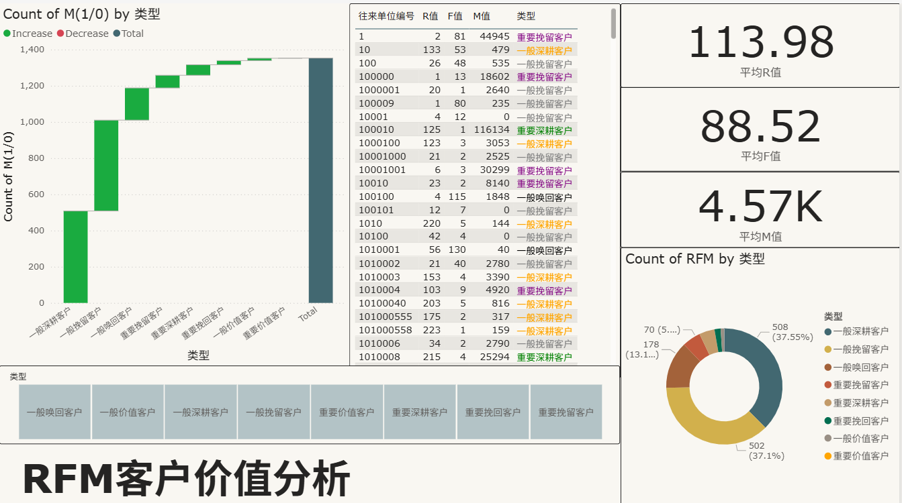
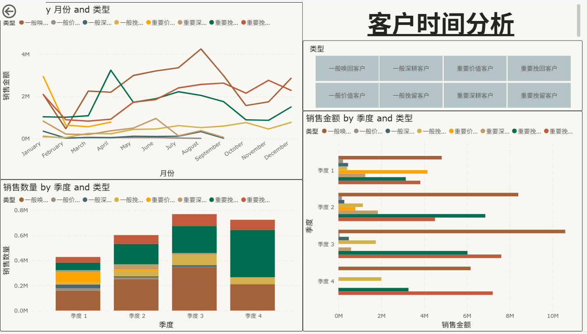

# Data Engineering & BI Portfolio - Aria

欢迎来到我的数据分析作品集仓库！这里展示了我利用 Power BI, SQL 和 Python 解决业务问题的实战案例。

---

## 📊 重点项目展示 (Featured Projects)

### 1. 亚马逊女装市场趋势与竞争分析 (Amazon Market Analysis)
- **业务场景 (Context):** 分析 2020-2024 细分品类变动，挖掘 Q1 高价值面料流行趋势，辅助选品决策。
- **技术栈 (Tech Stack):** Power BI (DAX), Python (数据清洗), 文本挖掘。
- **核心成果 (Impact):** 通过看板定位了 3 款高退货率材质缺陷，驱动产品优化，预计降低 5% 退货率。
- **[🔗 点击此处在线体验报表 (Live Demo Link)](https://app.powerbi.com/links/Jxb_jdFITl?ctid=fe82df55-cf04-425b-92ff-7a23e5be4857&pbi_source=linkShare)**

#### 报表预览 (Preview):

---

### 2. 全球运营绩效中心 (Global Operations Performance Hub)
- **业务场景 (Context):** 为管理层季度复盘提供支持，实时监控设计师与美工的人效产出与制图产出比。
- **技术栈 (Tech Stack):** Power BI (高级 DAX 建模), SQL 自动化预处理。
- **核心成果 (Impact):** 实现了人效指标的自动化核算，将季度复盘数据准备时间从 3 天缩短至 1 小时。
- **[🔗 点击此处在线体验报表 (Live Demo Link)](这里粘贴你该项目的公开URL)**

#### 报表预览 (Preview):

---

### 3. 客户价值分析系统 (Customer Value Analysis)
- **业务场景 (Context):** 基于 RFM 模型进行客户分群，分析产品关联购买行为（Basket Analysis）及区域时间分布。
- **技术栈 (Tech Stack):** Power BI, 关联规则分析, 客户画像。
- **[🔗 点击此处在线体验报表 (Live Demo Link)](这里粘贴你该项目的公开URL)**

#### 报表预览 (Preview):

---

## 🛠 技能清单 (Technical Skills)
- **BI 工具:** Power BI (精通 DAX), FineReport
- **数据工程:** SQL (窗口函数、复杂查询), Python (Pandas/Numpy)
- **业务流程:** Power Automate 逻辑, 企业微信机器人自动化推送
